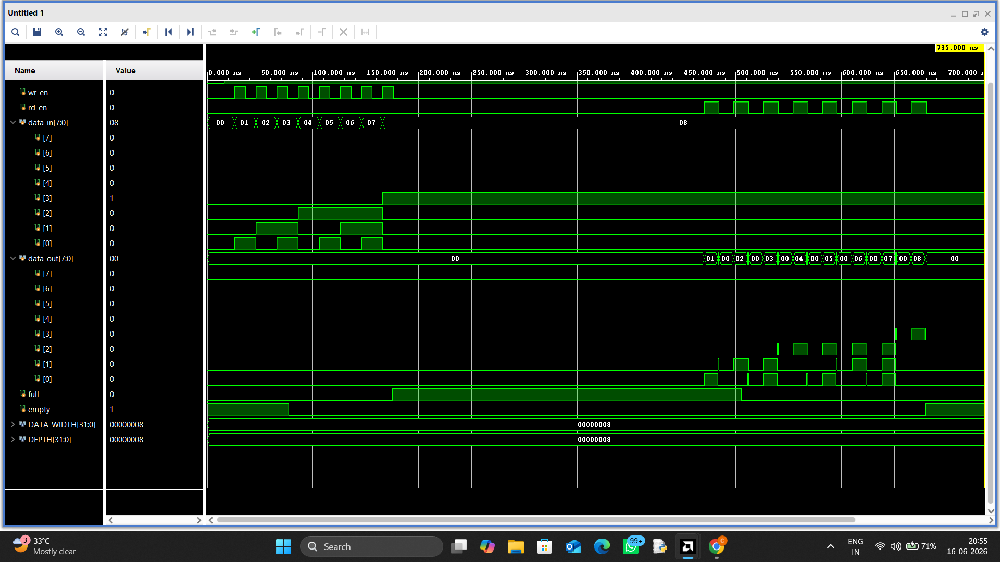

# Asynchronous FIFO Design

## Overview

This project implements a parameterized Asynchronous FIFO using SystemVerilog for safe data transfer between independent clock domains.

## Features
* Configurable DATA_WIDTH and DEPTH
* Independent read and write clock domains
* Gray code pointer synchronization
* Two-flop synchronizers for clock-domain crossing (CDC)
* Full and empty flag generation
* FIFO verification using Vivado Simulator

### Tool Used
* Vivado Simulator

## Waveform

### Complete FIFO Operation
The waveform demonstrates:
* Independent read and write clock operation
* Gray code pointer synchronization
* Full flag assertion
* Empty flag assertion
* Successful data transfer across clock domains

## Modules
### async_fifo.sv
Top-level FIFO module integrating memory, pointer handlers, and synchronizers.

### wr_ptr_handler.sv
Write pointer generation and full flag detection.

### rd_ptr_handler.sv
Read pointer generation and empty flag detection.

### sync_2ff.sv
Two-stage synchronizer used for pointer synchronization between clock domains.
